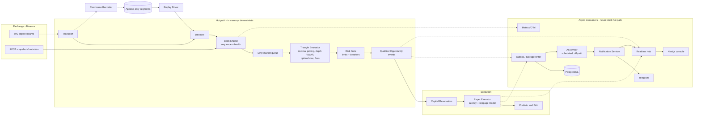
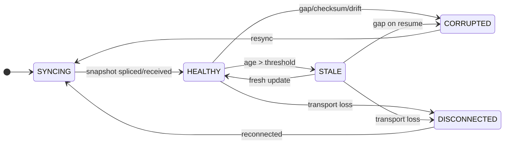
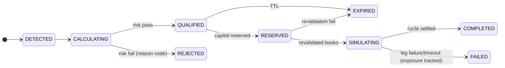

# Platform Architecture

Status: DESIGNED (Phase 1). Inputs: `docs/research/*` (Phase 0), SKILL.md.
Companions: `data-flow.md` (event flows, logical data model), `security.md`,
`risk.md`.

The platform is a single-exchange triangular-arbitrage research and
paper-trading system. Live trading is disabled by construction
(`LiveExecutor` returns `ErrLiveTradingDisabled`); the deterministic risk
engine gates everything; the hot path never blocks on I/O.

---

## 1. Process topology

One deployable Go binary, `arbd`, hosts all backend components in-process,
wired by `internal/app`. Components communicate through typed in-process
event streams (bounded channels), not a network bus — the hot path is a
function-call/channel path in shared memory. `cmd/` entries are thin mains
that enable component subsets of the same wiring:

| Entry | Components enabled |
|---|---|
| `cmd/arbd` | everything (default dev/deploy target) |
| `cmd/api` | API + realtime hub + storage (console against recorded/replayed data) |
| `cmd/scanner` | market data + books + triangles + opportunities + risk (headless) |
| `cmd/recorder` | market data + raw-frame recorder |
| `cmd/replay` | replay driver + full engine against recorded sessions |
| `cmd/worker` | scheduled jobs: reports, AI analyses, retention |

Rationale: separate processes would force an IPC bus (Redis/NATS — banned
without measured need) between the scanner and the console's real-time
feed. In-process components with clean interfaces keep the option to split
later; the interfaces are the seam.

**Operating modes** (mutually exclusive per run, surfaced everywhere):
`MARKET_DATA`, `RECORD`, `REPLAY`, `BACKTEST`, `PAPER`, `SHADOW`.
Mode selects the time source (wall clock vs recorded clock), the executor
implementation, and which components start.

## 2. Component map



Key property: everything below the dotted lines consumes events through
bounded, drop-aware queues. A slow database, UI client, Telegram API, or AI
provider can never stall book updates or opportunity qualification.

## 3. Package layout

```
cmd/{arbd,api,scanner,recorder,replay,worker}
internal/
  app/           wiring, lifecycle, modes, health
  config/        typed config, validation, versioning, diffs
  exchange/      normalized models + capability descriptors
    binance/     transport, decoder, sequence validator, metadata provider
  marketdata/    feed orchestration, subscriptions, clock manager, recorder
  orderbook/     Book, Ladder, health state machine, drift checks
  graph/         conversion-edge graph, triangle enumeration, topology cache
  triangle/      per-triangle evaluation state, dirty tracking
  pricing/       decimal depth walks, VWAP, optimal-size search
  fees/          fee schedules, per-pair overrides, fee-in-kind math
  opportunity/   opportunity lifecycle, TTL, rejection reasons
  execution/     Executor interface, plans, LiveExecutor (disabled)
  simulation/    paper fill engine, latency/slippage models, outcomes
  portfolio/     virtual balances, exposure, P&L, snapshots
  reservation/   atomic capital reservation, idempotency
  risk/          limit engine, circuit breakers, risk events
  ai/            AIAdvisor interface, providers, schemas, scheduler
  telegram/      bot, commands, buttons, auth mapping
  notification/  routing, cooldowns, dedup, channels
  reporting/     daily/weekly report builders
  auth/          users, sessions, RBAC, CSRF, rate limiting
  audit/         append-only audit writer
  realtime/      WS hub, topics, batching, resync
  metrics/       OTel setup, metric registry
  storage/       repositories, outbox, migrations runner
web/             Next.js console
migrations/      SQL migrations
deploy/          docker-compose, dashboards, alert rules
docs/            this documentation
```

(`inventory/` from the skill's suggested shape is folded into `portfolio/`;
exposure tracking is a portfolio concern. Everything else follows the
suggested layout.)

## 4. Core interfaces

```go
// exchange: split capabilities — never one god interface (SKILL.md §10)
type MarketDataConnector interface {
    Run(ctx context.Context) error            // owns transport + decode + apply
    SetSubscriptions(markets []MarketID)      // triangle topology drives this
    Books() orderbook.Source                  // versioned, health-aware reads
    Health() FeedHealth
}
type TradingMetadataProvider interface {
    Instruments(ctx) ([]InstrumentRules, error)
    FeeSchedule(ctx) (FeeSchedule, error)     // per-pair, account-aware
    ServerTime(ctx) (time.Time, error)
}
type AccountProvider interface {              // demo/testnet/read-only only
    Balances(ctx) ([]Balance, error)
}

// orderbook
type Source interface {
    View(id MarketID) (BookView, bool)        // consistent snapshot of top-K
    SubscribeDirty(ch chan<- MarketID)        // coalesced change notifications
}
type SequenceValidator interface {            // per-venue rule
    Check(cur BookMeta, ev DepthEvent) Action // Apply | Drop | Gap | Reset
}

// execution boundary (SKILL.md §3)
type Executor interface {
    ExecuteCycle(ctx, plan CyclePlan) (CycleResult, error)
}
// PaperExecutor, ReplayExecutor, SimulationExecutor, ShadowExecutor implement it.
// LiveExecutor exists and ALWAYS returns ErrLiveTradingDisabled.

// risk: pure function of inputs + config version — AI can never override
type Engine interface {
    Evaluate(op Opportunity, rc RiskContext) RiskDecision
}

// reservation: atomic, idempotent
type Manager interface {
    Reserve(key IdemKey, req ReserveReq) (Reservation, error)
    Settle(id ReservationID, outcome SettleOutcome) error
    Release(id ReservationID, reason string) error
}

// ai: analyst only, off-path
type Advisor interface {
    Analyze(ctx, req AnalysisRequest) (AnalysisResult, error) // schema-validated
}
```

All money/quantity values in these models are `decimal.Decimal`
(shopspring/decimal); float64 on a financial path is a P0 defect.

## 5. Concurrency model

- **Feed goroutines**: one reader per WS connection; decode on the same
  goroutine (no cross-goroutine handoff before the book applies) to keep
  per-book ordering trivially correct. Each book has a single writer — the
  feed goroutine that owns its market.
- **Book reads**: short-critical-section RWMutex per book; evaluators take
  an immutable top-K copy (`BookView{Version, Bids, Asks, Age, State}`).
  Contention is bounded (writers touch one book; readers copy small
  slices). Benchmark before optimizing further (seqlock/COW only if
  measured).
- **Dirty queue**: applying an update pushes the market into a coalescing
  dirty set + bounded channel. The evaluator pool (N ≈ CPU count) drains
  it, looks up affected triangles from the topology cache, and re-prices
  only those. Saturation of the dirty queue is a circuit-breaker signal,
  never an unbounded buffer.
- **Evaluator → risk → opportunity**: synchronous function calls on the
  evaluator goroutine (deterministic, allocation-conscious). Qualified
  opportunities are published to the event stream (bounded fan-out).
- **Paper engine**: its own goroutine pool consuming qualified
  opportunities; each cycle simulation is sequential per cycle, concurrent
  across cycles, capped by `maximum_concurrent_simulations`; capital
  reservation serializes conflicting triangles.
- **Async consumers** (storage outbox, realtime hub, notifications,
  metrics): each has a bounded queue with an explicit overflow policy —
  storage: backpressure counter + breaker; realtime: drop-and-resync per
  client; notifications: severity-aware drop of duplicates.
- **Shutdown**: context cancellation propagates root→leaves; feeds close
  first, then evaluators drain, then executors settle open simulated
  cycles as ABORTED, then outbox flushes with deadline. No goroutine is
  spawned without an owner and a bound.
- **Time**: a `Clock` interface everywhere (wall clock in live modes,
  recorded clock in REPLAY/BACKTEST); stochastic simulation draws from a
  seeded RNG owned by the run — determinism requirement (SKILL.md §64).

## 6. Hot path contract (SKILL.md §21)

WS frame → decode → sequence-validate → apply to book → mark dirty →
affected-triangle re-price (decimal, depth-aware, fees, buffers) → risk
gate → qualified opportunity event.

Forbidden on this path: PostgreSQL, Redis, AI, Telegram, frontend I/O,
network logging, unbounded allocation, locks held across I/O. Everything
downstream is bounded-queue fan-out. Metrics on this path are atomic
counters/gauges only.

## 7. API boundaries

Versioned REST under `/api/v1/*` per SKILL.md §61 groups. Conventions:
- Envelope: `{ "data": ..., "error": null | {code, message, details,
  correlation_id} }`; cursor pagination (`?cursor=&limit=`); filtering via
  documented query params; sorting `?sort=field:asc`.
- Correlation ID: accepted via `X-Correlation-ID` or generated; propagated
  through logs, audit events, and responses.
- AuthN: session cookie (HttpOnly, Secure, SameSite=Lax) from
  `/api/v1/auth/login`; CSRF token (double-submit header) for mutating
  browser calls. AuthZ: RBAC middleware per route group; server-side only.
- All financial numbers serialized as strings (decimal-safe), never JSON
  floats.
- OpenAPI document maintained in `docs/api/openapi.yaml`, served at
  `/api/v1/docs` in dev.

## 8. Real-time architecture

Single WS endpoint `/api/v1/ws` (same session auth). Topic-based
subscribe/unsubscribe protocol:

```
client → {"op":"subscribe","topics":["scanner","health","cycles","pnl","alerts"]}
server → {"topic":"scanner","seq":123,"snapshot":true,"data":{...}}
server → {"topic":"scanner","seq":124,"data":{...batched diff...}}
```

Background job topics (`campaigns`, `replays`) follow the same
subscribe/snapshot/diff shape but publish on job-state transitions
(queued → running → done/failed) rather than a fixed tick: the topic's
snapshot handler lists in-memory + persisted runs, and every
`Runner.persist()` call re-publishes the changed run so a page reload
never needs to poll (T-058 BL-17).

- On subscribe: snapshot, then diffs; per-topic monotonically increasing
  `seq` lets clients detect loss; a gap triggers client-side resubscribe
  (server treats resubscribe as snapshot request).
- Server batches per topic on a 100–250ms tick with coalescing (scanner
  rows keyed by opportunity/triangle id) — the browser never receives the
  raw L2 firehose; a focused order-book view uses an explicit
  `book:EXCHANGE:SYMBOL` topic with throttled top-K snapshots.
- Per-client bounded send queue; on overflow the client is marked lagging,
  queued diffs are dropped, and the next frame is a fresh snapshot
  (`resync:true`).
- Heartbeat ping/pong; idle timeout; reconnect with jitter client-side.

## 9. Client architecture (web console)

Next.js (App Router) + TypeScript + Tailwind. Structure:

```
web/src/
  app/(auth)/login
  app/(console)/{overview,scanner,triangles,opportunities,paper,orders,
                 fills,portfolio,pnl,exchanges,markets,strategies,ai,
                 risk,replay,reports,alerts,telegram,system,audit,users,
                 settings}/page.tsx
  lib/api/       typed client (generated from OpenAPI), fetch wrappers
  lib/ws/        WS client: subscribe, seq tracking, resync, backoff
  lib/format/    decimal/bps/currency formatting (display only)
  components/    tables (virtualized), charts, status chips, forms
  stores/        client state (per-page slices fed by WS topics)
```

Rules: the backend is authoritative for every financial number — the
client formats strings, never recomputes profitability; large tables are
virtualized with row-level keyed updates; WS diffs update stores without
page-wide rerenders; dark-mode-first theme tokens; every page has
loading/empty/error/degraded states (degraded = data stale banner driven
by the health topic).

## 10. Telegram architecture

`internal/telegram` runs a long-polling bot (no inbound webhook needed).
Update pipeline: allow-list check (configured Telegram user ID → platform
user + role) → command parser (strict, no free-text interpretation) →
the SAME application services the web console uses (authorization enforced
in the service layer, not the handler) → formatted reply. Inline buttons
carry signed callback payloads `{action, entity, nonce}`; dangerous
actions require a second confirm tap; every action writes an audit event
with source=telegram. Push alerts flow only through the Notification
Service (severity thresholds, cooldowns, dedup, aggregation). Telegram
text is untrusted input end-to-end (SKILL.md §68); it never reaches AI
prompts or config values without validation.

## 11. Notification service

Domain events → notification router → channel adapters (Web hub, Telegram,
future email). Routing config per event type: severity, channels,
cooldown window, dedup key, aggregation window. Core packages emit domain
events; only `internal/notification` talks to Telegram.

## 12. Storage architecture

- PostgreSQL via `pgx`; repositories in `internal/storage`; forward-only
  SQL migrations in `migrations/` (golang-migrate compatible naming).
- Hot path decoupling: an in-process outbox (bounded channel + batching
  writer) persists opportunities, cycles, orders, fills, snapshots. The
  writer batches inserts (COPY/multi-row) on a tick; overflow increments a
  drop counter and trips the persistence breaker per policy.
- Raw market data is NOT stored row-wise: append-only compressed segment
  files (see `data-flow.md` §5) with only metadata registered in
  `market_recording_metadata`.
- Audit events are insert-only; application role has no UPDATE/DELETE on
  audit tables.
- Background job runners (`internal/campaign.Runner`, `internal/replay.Runner`)
  persist one row per run (`campaign_runs`, `replay_runs`) through their own
  small `RunStore` interfaces, upserted on every state transition — not
  the outbox: a job runner already owns a single background goroutine, so
  there is no hot-path contention to decouple, and the row must be
  visible synchronously enough that a restart's orphan-reconciliation
  pass sees it. That pass does NOT mark every row still "queued"/
  "running" as "failed: interrupted": each row also carries an
  `owner_id` + `heartbeat_at` (migration 000009, review T-058 P3-h),
  stamped on every write and re-stamped by a dedicated heartbeat
  goroutine independent of progress callbacks; reconciliation only
  reclaims a row whose heartbeat has gone stale (or is absent —
  pre-migration rows, or one this process never itself started) via
  `internal/jobrun.Reclaimable` — never a row a DIFFERENT, still-live
  process is actively updating (two processes sharing one Postgres, a
  rolling-deploy overlap or an operator running two instances, would
  otherwise each reclaim the other's active run at boot).
  `internal/jobrun` is a small shared package (`Gate` for the Start-
  before-Run lifetime-context race, `Bound`/`ClampLimit` for the
  in-memory run map's 200-entry ring, `Reclaimable`/`NewOwnerID`/
  heartbeat constants) both runners use identically so a fix to one
  cannot drift from the other; each `Runner` keeps its own
  `execute()`/`persist()`/`List()` around it — not a shared generic
  Runner, the two job shapes (`replay.Run` vs `campaign.Run`) differ
  enough that collapsing them would cost more clarity than it buys.
  `risk_events` (breaker transitions and throttled risk rejections, T-058
  BL-31) goes through the outbox instead, because it IS on the hot path
  (`internal/risk`'s breaker callback and the scanner's reject branch).

  `GET /api/v1/risk/events`, `GET /api/v1/replays[/{id}]`, and
  `GET /api/v1/campaigns[/{id}]` are the read side of these three tables.

## 13. Configuration model

Typed config tree: static bootstrap (env: ports, DB DSN, secret refs) vs
dynamic strategy config (DB-backed, versioned): profitability thresholds,
buffers, capital, TTLs, filters, risk limits, notification routing. Every
dynamic change: validate → new immutable version row (actor, timestamp,
diff) → audit event → hot-swap via atomic pointer; components read a
consistent config snapshot per evaluation (config version cited in every
opportunity and risk decision). Rollback = re-activating a prior version
(itself a new version + audit event).

**Platform settings (T-057, `docs/design/platform-settings-and-restart.md`).**
A second versioned document — symbols, starting assets, per-asset paper
balances, venue enabled/paper-enabled, per-venue fee tier and per-symbol fee
overrides, Telegram allowlist — lives in `internal/platform` and
`platform_settings`, deliberately **not** in `strategy.Params`: the
section→permission mapping (`auth.PermissionForConfigSection`) fails open to
OPERATOR for any new section, strategy versions are cited as provenance by
every opportunity, and symbol validation is impure (needs `exchangeInfo` plus
a `graph.Build` dry-run). Env vars are first-boot seeds only. Every field is
restart-scoped except the Telegram allowlist; restart-scoped changes are
applied by `app.Supervisor`, which re-enters one stable `Engine.Run` (so all
existing engine seams keep working) after draining the recorder, pausing
paper and waiting for the outbox — persisted history is never lost.

**Settings expansion (T-059/T-060/T-061,
`docs/design/settings-expansion.md`).** The same document gains
`platform.mode` (restart-scoped; enum `MARKET_DATA|RECORD|PAPER|SHADOW` —
`LIVE` is rejected by name, `REPLAY`/`BACKTEST` stay batch-only entry
points), `platform.log_level` and `platform.allowed_origin` (hot), an `ai`
section and `telegram.disabled` (hot — a negative field so its zero value
on an already-persisted document means "keep delivering"). The
hot/restart split follows what a
*restart actually rebuilds*: the Supervisor re-enters `Engine.Run` only, so
anything owned by a sibling Component (AI scheduler, Telegram bot,
`api.Server`) is made hot through an atomic accessor rather than labelled
"restart", which would silently mean "redeploy". Because the payload is
JSONB, `Settings.WithDefaults` normalizes pre-expansion versions wherever a
stored payload becomes a `Settings` (load, get, rollback) — otherwise a
deploy would fail validation at boot. The fill is field by field, and when
the `ARB_MODE`-seeded `platform.mode` breaks a cross-field rule the stored
venues carry (e.g. `PAPER` over `paper_enabled=false`) it falls back to
`MARKET_DATA` with a WARN naming the substitution; a stored mode is never
rewritten. Secrets (Anthropic key, Telegram
token) move to a `secrets` table encrypted with AES-256-GCM under
`ARB_SECRET_KEY`, resolved through a vault-first/env-fallback
`SecretSource` (a vault read that fails at the store level logs a WARN
before the env fallback; an unreadable row does not), write-only over the
API (the value is decoded into a `[]byte` that is zeroed after the write;
`secret.write`/`secret.delete` audit rows carry
`after={name,present,key_id}`), with a closed two-name registry:
no exchange trading key is ever stored, and live trading stays disabled.

Implemented surface (backend): `platform.ModeTable`/`VenueTable`/
`AIProviderTable` are the single source for `GET /api/v1/platform/
capabilities` (and the `/platform/venues` alias); `ai.Switch` holds the
swappable advisor, `ai.Scheduler` re-arms from `ai.schedule` at every
wake, and `ai.Service` enforces `budget.max_analyses_per_day`
(per-process UTC counter) and passes `max_output_tokens` to the provider;
`app.SetLogLevel` drives a package-scoped `slog.LevelVar`;
`api.Server.SetAllowedOrigin` feeds the websocket origin check; `app.
Supervisor` names a mode transition in `pending_reasons`
(`"platform settings v9: mode MARKET_DATA→PAPER"`) and `Engine.Mode()`
reports the running mode (snapshotted per run). Tables: `secrets(name PK,
ciphertext, nonce, key_id, updated_at, updated_by)`. Routes: `GET/PUT/
DELETE /api/v1/secrets[/{name}]`, `GET /api/v1/ai/status`. Audit actions:
`secret.write`, `secret.delete` (entity `secret:{name}`, no before
payload). The `health` topic's `mode` is now `{running, configured}`.

## 14. Observability

OTel SDK with Prometheus exporter at `/metrics`; metric set per SKILL.md
§65; structured JSON logs (slog) with correlation/domain IDs; optional
tracing on the non-hot API paths. System-health API aggregates: component
states, queue depths, goroutines, GC, DB pool, per-feed health, clock
quality. Dashboards + alert rules in `deploy/observability/`.

## 15. Failure model

| Fault | Detection | Response | Recovery |
|---|---|---|---|
| WS disconnect | read error/heartbeat miss | books → DISCONNECTED; affected triangles suppressed; breaker opens per policy | reconnect with backoff; resubscribe; resync books; HEALTHY restores qualification |
| Sequence gap | validator chain break | book → CORRUPTED; drop opportunities citing it | full resync (REST snapshot or in-band) |
| Stale book | age > threshold | book → STALE; triangles suppressed | next update restores HEALTHY |
| REST snapshot failing | init/resync errors | book stays SYNCING; alert after N attempts | backoff retries |
| Clock drift | NTP/server-time divergence | data marked unsafe; qualification suspended; alert | drift clears → resume |
| Dirty-queue saturation | queue depth watermark | breaker: pause qualification (safe default: do nothing) | drain + manual/auto reset per policy |
| DB degraded | outbox overflow/errors | persistence breaker; qualification continues or pauses per config; alert | DB recovers → flush |
| AI provider down | request failures | advisor features unavailable; scanner unaffected | provider recovers |
| Telegram down | send failures | notifications queue/drop per severity; alert via web | resume |
| Paper-engine inconsistency | invariant checks (balance conservation) | halt paper engine; CRITICAL alert; state preserved for forensics | operator action |
| Process crash | supervisor restart | books rebuild from live feeds; paper session resumes from persisted state; in-flight cycles marked ABORTED | automatic |

Safe default everywhere: DO NOTHING — no qualification, no simulation,
no state mutation on uncertain inputs.

## 16. Book/cycle state machines





## 17. Deferred decisions (revisit with measurements)

- Splitting scanner/API into separate processes (needs measured need).
- Redis for realtime fan-out at high client counts (not before).
- Parquet derivation of recordings for analytics (Phase 17+).
- seqlock/COW book reads if RWMutex contention shows in profiles.
