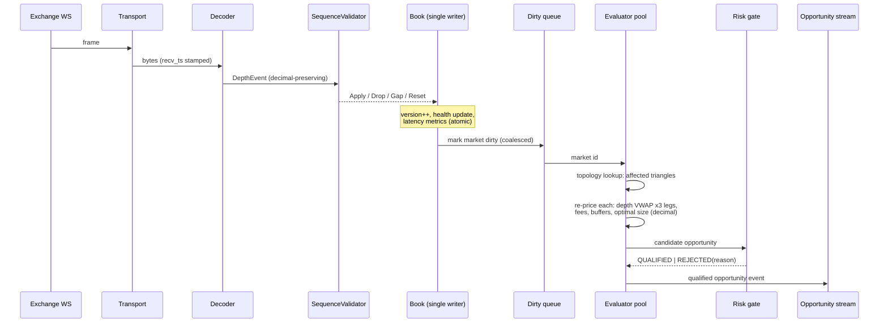

# Data Flow & Logical Data Model

Status: DESIGNED (Phase 1). Companion to `architecture.md`.

## 1. Hot-path flow (per WS frame)

Timing budget targets (validated by benchmarks in Phase 8, revisited by
the performance engineer): decode+apply < 50µs typical; affected-triangle
re-price < 200µs per triangle at 50-level depth; end-to-end frame→
qualified event < 2ms p99 under burst. These are working targets, not
guarantees; measured numbers replace them in this doc as they land.

## 2. Paper-cycle flow (per qualified opportunity)

1. Paper engine receives qualified opportunity (bounded queue; stale-drop
   by TTL before anything else).
2. Reservation: `Reserve(idempotency_key = opportunity_id)` — atomic check
   of available virtual balance + conflicting-triangle locks; duplicates
   are rejected by key.
3. Revalidation: fresh `BookView` for all three legs; if any book version
   moved beyond tolerance or health degraded → recalculate; if the edge
   no longer clears thresholds → release reservation, opportunity EXPIRED.
4. Leg simulation (sequential legs, `SimClock`-driven): submit-latency
   draw → book state at fill time → fill against depth (VWAP, partial
   possible) → fee applied in the venue's fee asset → truncation to
   instrument precision → output quantity feeds next leg.
5. Outcome: ALL_FILLED | LEG1_PARTIAL | LEG1_FILLED_LEG2_FAILED |
   LEG1_LEG2_FILLED_LEG3_FAILED | PARTIAL_CYCLE | TIMEOUT | EXPIRED |
   REJECTED. Non-complete outcomes compute residual intermediate exposure
   and mark-to-market P&L; exposure posts to the portfolio as a position,
   never silently dropped.
6. Settlement: reservation settled (consumed/released amounts), balances
   updated, cycle + orders + fills emitted to outbox, realtime hub, and
   notification router.

## 3. Event catalogue (in-process streams)

| Event | Producer | Consumers |
|---|---|---|
| DepthApplied {market, version, ages} | book engine | metrics; (sampled) recorder metadata |
| BookHealthChanged {market, from, to, reason} | book engine | risk breakers, hub, notifications, metrics |
| OpportunityDetected/Qualified/Rejected | evaluator/risk | outbox, hub, paper engine (qualified only), metrics |
| ReservationChanged | reservation | outbox, hub |
| CycleStarted/Settled {outcome, pnl, exposure} | paper engine | outbox, hub, notifications, portfolio |
| OrderSimulated / FillSimulated | paper engine | outbox, hub |
| BalancesChanged / ExposureChanged | portfolio | outbox, hub |
| RiskEvent {limit, breaker, action} | risk | outbox, hub, notifications, audit |
| ConfigChanged {version, actor, diff} | config service | all components (snapshot swap), audit, hub |
| AlertRaised/Acknowledged/Resolved | any → notification svc | hub, Telegram, outbox |
| AIRecommendationCreated/Decided | ai / approval flow | outbox, hub, notifications, audit |
| ClockQualityChanged | clock manager | risk breakers, hub |
| SystemHealthTick | app | hub, metrics |

Every event carries: event_id (ULID), occurred_at (Clock), correlation_id,
config_version where applicable. Events are the single source for
persistence, UI, Telegram, and reports — no side channel state.

## 4. Logical data model (PostgreSQL)

Conventions: NUMERIC for all money/quantity, timestamptz UTC, ULID text
PKs for domain entities, insert-only where noted. Full DDL lives in
`migrations/`; this is the logical shape.

- **users** (id, email, display_name, password_hash, role, status,
  mfa_enrolled, created_at) / **sessions** (id, user_id, expires_at,
  revoked_at, ip, ua)
- **exchanges** (id, name, enabled, paper_enabled, capabilities jsonb) /
  **exchange_health** (exchange_id, ts, feed_state, latency_ms, clock_offset_ms,
  reconnects, seq_errors — periodic snapshots)
- **markets** (id, exchange_id, symbol, base, quote, enabled, rules jsonb
  {tick, step/decimals, min_qty, min_notional}, fee_override jsonb,
  status) — refreshed from venue metadata; changes audited
- **triangles** (id, exchange_id, legs jsonb [{market, direction}],
  starting_asset, canonical_key unique, enabled, discovered_at,
  liquidity_score)
- **opportunities** (id, exchange_id, triangle_id, status, reason_code,
  starting_asset, starting_amount, legs jsonb [{market, side, vwap,
  depth_used, fee_asset, fee_amount, out_amount, book_version}],
  gross/net amounts + bps, buffers bps, optimal_size, max_profitable_size,
  confidence, data_quality, config_version, detected_at, decided_at,
  expires_at) — high volume: qualified + sampled rejections persist,
  full rejection stats aggregate into counters
- **paper_sessions** (id, mode, started_at, ended_at, starting_balances
  jsonb, config_version, seed) — history is never deleted on reset; reset
  creates a new session
- **paper_cycles** (id, session_id, opportunity_id, outcome, pnl_amount,
  pnl_asset, fees jsonb, slippage_bps, exposure jsonb, started_at,
  settled_at)
- **orders** (id, cycle_id, leg_no, market_id, side, type, tif, qty_req,
  qty_filled, price_req, price_avg, fee_amount, fee_asset, latency_ms,
  status, created_at, acked_at, filled_at) / **fills** (id, order_id,
  price, qty, fee_amount, fee_asset, ts, book_version)
- **virtual_balances** (session_id, exchange_id, asset, available,
  reserved, updated_at) / **balance_snapshots** (session_id, ts, balances
  jsonb, mark_values jsonb)
- **pnl_snapshots** (session_id, ts, realized, unrealized, fees_paid,
  slippage_cost, drawdown, by_dimension jsonb)
- **strategy_configs** (id=version, created_by, created_at, active,
  payload jsonb, diff jsonb, parent_version) — immutable rows
- **ai_recommendations** (id, created_at, scope, parameter, current_value,
  recommended_value, evidence jsonb, reason, confidence, expected_effect,
  risks, expires_at, status {proposed,approved,rejected,deferred,expired},
  decided_by, decided_at) — insert + status-transition only
- **risk_events** (id, ts, kind, subject, limit_name, observed, threshold,
  action, breaker_state, correlation_id) — insert-only
- **alerts** (id, ts, severity, source, title, body, dedup_key, state
  {active,acked,resolved}, acked_by/at, resolved_by/at) — critical alerts
  retained regardless of state
- **notifications** (id, alert_id/event ref, channel, status, sent_at)
- **reports** (id, kind, period, generated_at, payload jsonb, storage_ref)
- **audit_events** (id, ts, actor, source {web,telegram,system,ai},
  action, entity, entity_id, before jsonb, after jsonb, ip,
  correlation_id) — INSERT-ONLY (no app UPDATE/DELETE grants)
- **system_events** (id, ts, component, kind, detail jsonb)
- **market_recording_metadata** (id, exchange_id, started_at, ended_at,
  streams jsonb, segment_files jsonb [{path, from_ts, to_ts, frames,
  bytes, sha256}], config_version, notes)

Indexes follow console queries: opportunities(triangle_id, detected_at),
opportunities(status, detected_at), cycles(session_id, settled_at),
orders(cycle_id), alerts(state, severity, ts), audit(entity, ts), etc.

## 5. Raw recording format

Append-only segment files per exchange+stream:
`recordings/{exchange}/{yyyy-mm-dd}/{stream}-{seq}.seg.zst`

Frame record (length-prefixed binary): `recv_ts_ns (int64) | dir (u8:
in/out) | stream_id (u16) | payload_len (u32) | raw payload bytes`.
Zstandard-compressed, rotated by size/time; sha256 + frame counts recorded
in `market_recording_metadata`. REST snapshots taken during init/resync
are recorded as synthetic frames (stream_id flags REST) so replay
reproduces splice decisions byte-for-byte. Replay feeds these frames into
the SAME Decoder → Validator → Book path with the recorded clock;
identical config + seed ⇒ identical outputs (SKILL.md §64).

## 6. Retention

- opportunities: qualified kept 90d, sampled rejections 14d, aggregates
  indefinitely; cycles/orders/fills: lifetime of session + archival dump;
  exchange_health/system_events: 30d; audit: never auto-deleted;
  recordings: by disk budget with explicit operator-approved pruning.
  Retention jobs run in `cmd/worker` and are audited.
