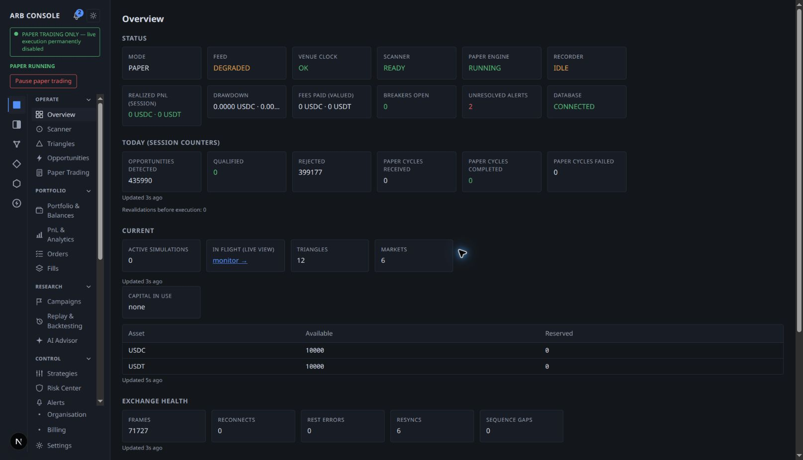
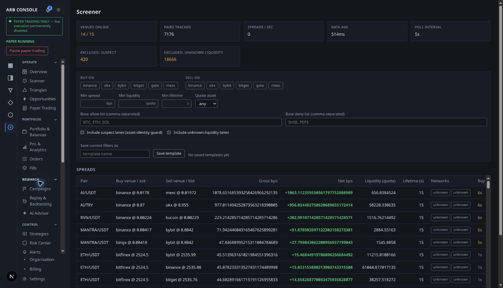
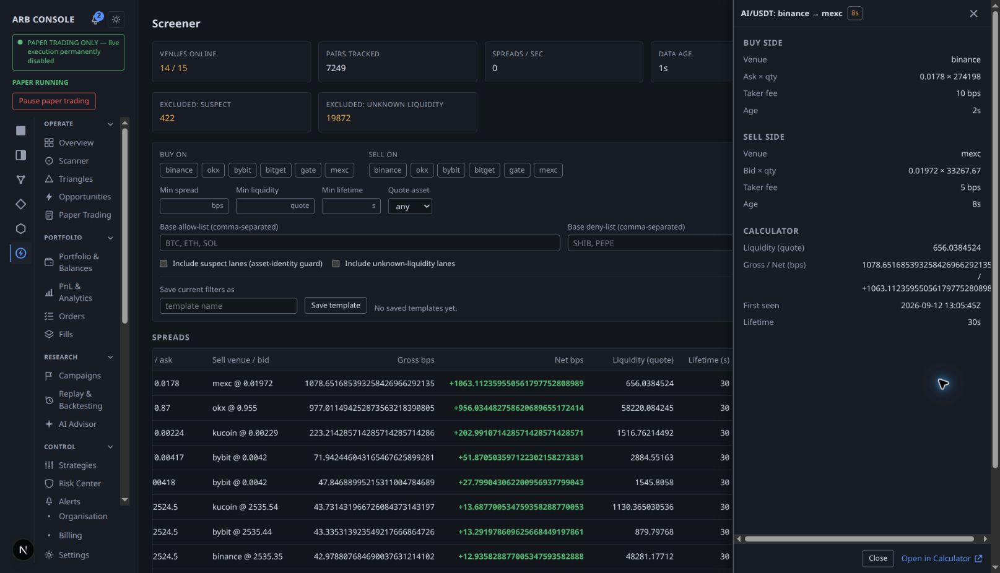
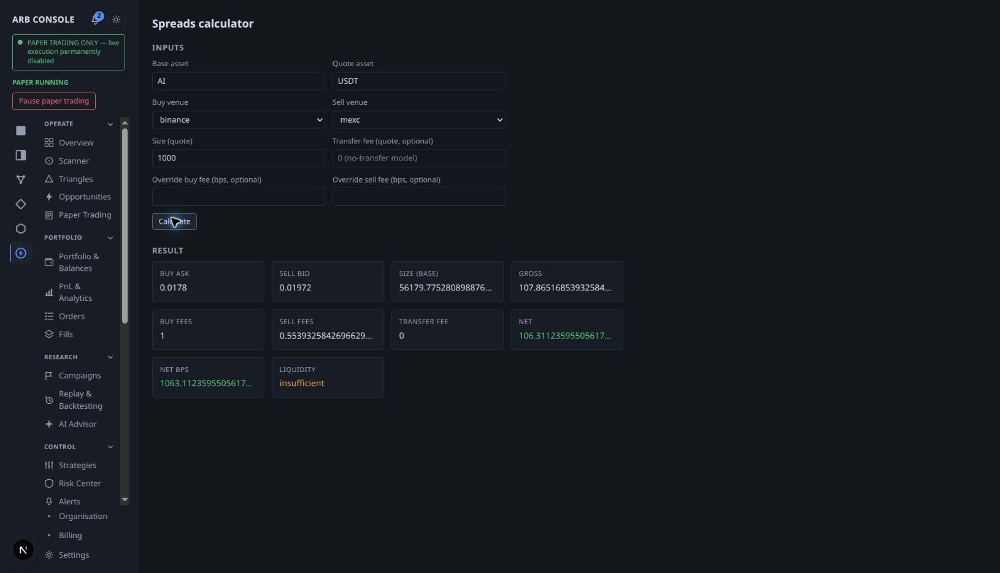
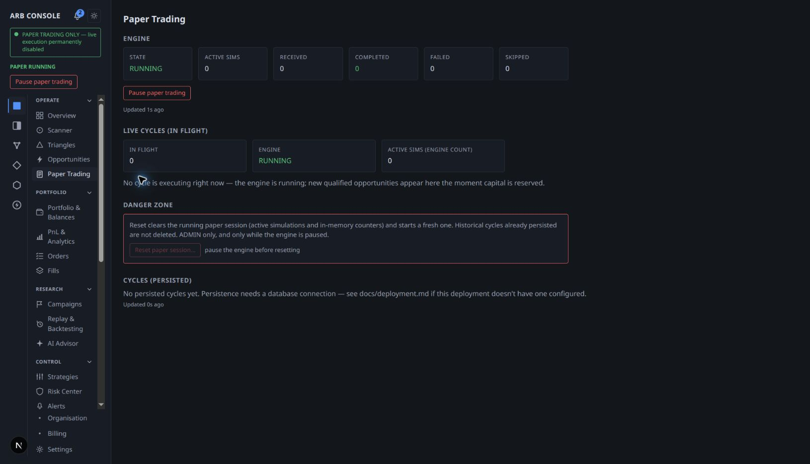
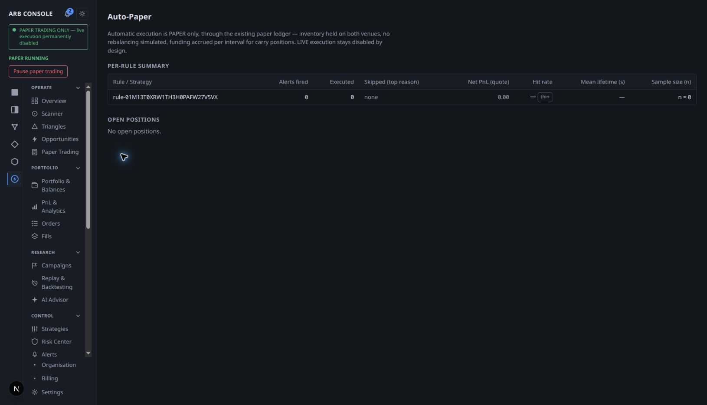
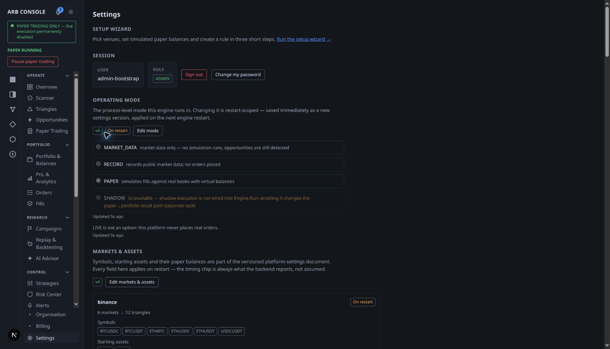

# Client-area audit and Claude Code handoff

Captured 2026-09-12 in the user's connected Brave extension, at localhost:3000.
Scope: desktop dark-mode interface, existing authenticated ADMIN session. No
login credentials were needed or saved. This review prepared an implementation
command; application source was not redesigned in this session.

The central issue is hierarchy: the interface exposes many internal capabilities
at once, gives operational counters similar prominence to user outcomes, and
shows raw decimal precision where concise display would make comparisons easier.

## Runnable implementation command

From this repository, start Claude Code and enter:

```text
/refine-client-area
```

The complete prompt is `.claude/commands/refine-client-area.md`. It coordinates
UX, UI, frontend, backend contract review, QA, and independent review, with concrete
scope, route mappings, safety constraints, and acceptance criteria. This command
has been prepared, not executed. Claude Code's documentation confirms that project
Markdown command files still create slash commands:
[Claude Code custom skills and commands](https://code.claude.com/docs/en/skills).

## Captured steps and findings

### 1. Overview — functional, overloaded



The mode banner, paper pause control, signed result figures, data-age labels,
and links from status figures are useful foundations. However, twelve status
cards precede six session counter cards, followed by further current-state and
exchange-health cards. The navigation has a separate group icon rail alongside
an independently scrolling label column. Source inspection confirms 29 entries
across six groups plus Organisation, Billing, and Settings in the footer.

**Priority:** high. Make status/attention/next action primary; move diagnostics
into secondary sections. Consolidate primary navigation by user task. A drawdown
figure is visibly truncated; keep full units and readable per-asset results.

### 2. Cross-exchange Screener — functional, difficult to scan



The screen has useful venue health, safe exclusion controls, freshness values,
saved-filter support, and positive/negative presentation. But seven counters and
the fully expanded filter form take up much of the first viewport. Gross and net
bps values contain more than twenty fractional digits. The table extends to the
right, leaving later freshness/action columns outside the initial view.

**Priority:** high. Common filters first, Advanced disclosure for less common
settings, concise exact-string-based display formatting, fewer default columns,
and important freshness/limitations visible alongside the candidate. Preserve
raw values and the meaning of every field; this is not a change to pricing math.

### 3. Spread detail — working handoff, drawer overflow



Selecting Detail opened a side panel for AI/USDT, with buy/sell information,
fees, ages, and an Open in Calculator action. Focus moved to the close button.
The drawer has horizontal overflow and very long gross/net values. Its title
and footer are useful, but information needs clearer grouping and bounded width.

**Priority:** high. Fit the drawer to the viewport and show exact precision on
demand. Preserve row identity and the working prefilled Calculator handoff.
Escape, focus cycling, and focus return were not comprehensively tested.

### 4. Calculator — working, feasibility needs priority



The handoff correctly prefilled asset, quote and both venues. Calculate returned
a result for the displayed default size. This was a calculation only, with no
trade or settings mutation. The result displayed green net/net-bps figures while
a separate lower card said liquidity was insufficient. Several values are cut
off with ellipses. Optional fee overrides are shown with basic inputs.

**Priority:** high. Put the actual backend feasibility outcome before the
estimate, explain the limitation, label amounts with their asset, and move
overrides into Advanced. The observed estimate is not evidence of an executable
or profitable opportunity. Keep all returned financial values unchanged.

### 5. Paper Trading — functional empty state, distracting controls



The active-cycle message correctly explains that the engine is running and
waiting for qualified opportunities. The page repeats state/active-count
summaries and pause controls, then shows a prominent Danger Zone before history.
Its history empty message discusses database configuration even though Overview
showed the database connected. That text is generic, not proof of a storage fault.

**Priority:** medium/high. Put monitoring/results first and reset below normal
work, while preserving its safeguards. Make empty-state guidance reflect actual
health. Prefer “Simulation history” to implementation terms like “persisted”.

### 6. Auto-Paper — functional, weak explanation and next steps



The page honestly displays zero executions, sample size zero, a thin-evidence
indicator, and no open positions. However, the main identifier is a long rule ID
and there is no prominent next step to understand/configure that rule. Technical
introductory copy and its separate navigation group make the relationship to
Paper Trading harder to understand.

**Priority:** medium. Use clearly named simulation subviews, contextual rule and
evidence links, and human-readable names when available. Do not merge metrics or
imply a global pause scope without confirming backend semantics.

### 7. Settings — functional, mixed purposes and technical copy



The top of Settings combines setup, account/session actions, engine operating
mode, and markets/assets. The complete accessibility tree and source show many
further administrative sections below. Version/timing indicators are valuable,
but helper copy includes implementation details such as Engine.Run, backend
wiring, and task identifiers. This was the administrator view; tenant views were
not tested and no privilege leak is asserted.

**Priority:** high. Separate account, organisation, billing and notifications
from platform administration. Use focused categories, preserved deep links,
plain helper text, and the existing preview/confirm/version-conflict mechanics.

## Recommended target

Six primary destinations: **Overview, Discover, Paper Trading, Research & Results,
Alerts & Rules, Settings**. Expose contextual subnavigation rather than all pages
at once. Keep critical risk/mode status discoverable and operator administration
explicit. Preserve every current route and the distinctions between triangular
and cross-exchange engines, organisation admins and platform staff, and operational
reports and screener evidence. The command contains a complete migration brief.

First implementation priorities:

1. Shared decimal presentation and Calculator feasibility hierarchy.
2. Shell navigation and Overview priorities.
3. Filters, table columns, and detail-panel readability.
4. Focused Settings categories and simulation task links.
5. Responsive, accessibility, role/entitlement and regression verification.

## Evidence limits and runtime recovery

- These are sampled desktop workflows, not a full product or accessibility audit.
  Screenshots are native viewport captures of changing live data; values differ
  between captures. They must not be treated as campaign/performance evidence.
- Mobile/tablet, light mode, 200% zoom, screen readers, full keyboard behavior,
  contrast measurements, other roles/entitlements, login, and submission/error
  workflows were not tested. These are mandatory follow-up checks in the command.
- No trading, pause/resume, reset, credential, rule, billing, or settings writes
  were performed. UI-navigation and read-only Calculator behavior were exercised.
- The initial browser page was an AI route ChunkLoadError; Overview then showed
  a missing generated `846.js` module. `00-ai-load-error.png` records the initial
  blocker, not an accepted working-flow screenshot. Recovery stopped the local
  Next frontend, preserved its old generated cache at
  `/tmp/arb-console-cache-audit-ig28azts/next-cache`, and started the same app on
  port 3000 with the existing explicit backend URL `http://localhost:8080`.
  The frontend subsequently rendered the captured pages. Root cause was not
  conclusively diagnosed, and AI itself was not rechecked after recovery.
- The Go backend and research session were not restarted. No application source
  changes or full regression suite were necessary for this documentation handoff.
- Prepared files were checked for referenced paths, screenshot readability,
  command frontmatter, and accidental credential inclusion. No Claude Code
  implementation run or product redesign is claimed.
